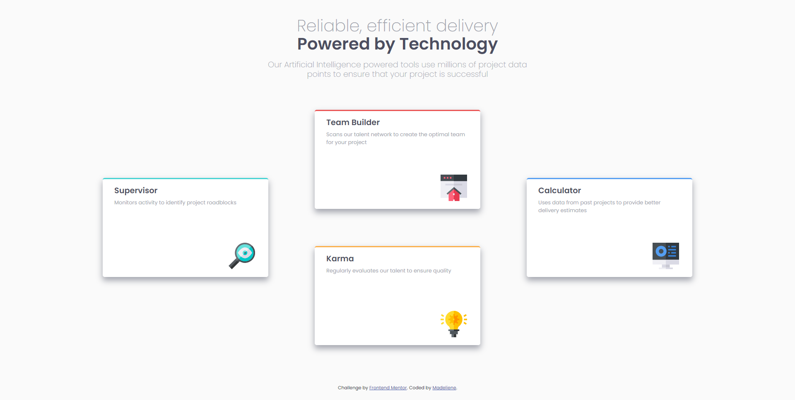
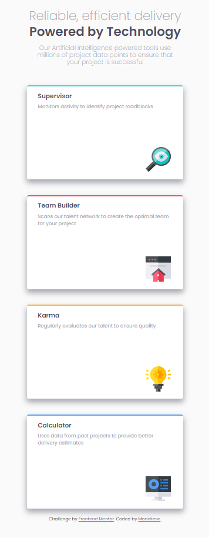

# Frontend Mentor - Four card feature section solution

This is a solution to the [Four card feature section challenge on Frontend Mentor](https://www.frontendmentor.io/challenges/four-card-feature-section-weK1eFYK). Frontend Mentor challenges help you improve your coding skills by building realistic projects.

## Table of contents

- [Overview](#overview)
  - [The challenge](#the-challenge)
  - [Screenshot](#screenshot)
  - [Links](#links)
- [My process](#my-process)
  - [Built with](#built-with)
  - [What I learned](#what-i-learned)
  - [Continued development](#continued-development)
  - [Useful resources](#useful-resources)
- [Author](#author)

## Overview

### The challenge

Users should be able to:

- View the optimal layout for the site depending on their device's screen size

### Screenshot
-Desktop view: <br>


-Mobile view: <br>


### Links

- Solution URL: [https://github.com/Madeliyen/Four-card-feature-section.git](https://your-solution-url.com)
- Live Site URL: [https://github.com/Madeliyen/Four-card-feature-section.git](https://your-live-site-url.com)

## My process

### Built with

- Semantic HTML5 markup
- CSS
- Bootstrap
- Mobile-first workflow

### What I learned

- Bootstrap Card
```html
<div class="card tool-card cyan">
  <div class="card-body">
    <h5 class="card-title tool-name">Supervisor</h5>
    <p class="card-text tool-desc">Monitors activity to identify project roadblocks</p>
    <div class="tool-img">
      
    </div>
  </div>
</div>
```
- CSS Box Shadow property
```css
.tool-card {
  width: 25rem;
  height: 15rem;
  border: none;
  border-top: 3px solid;
  border-radius: 5px;
  box-shadow: 0 8px 15px 1px hsl(229deg 6% 66%);
  justify-content: center;
  margin: 20px;
}
```
### Continued development

Areas and techniques to focus on and refine in future projects.
- Responsive web design
- CSS grid layout planning and execution
- Mobile first work flow

### Useful resources

- [Example resource 1](https://www.w3schools.com/cssref/css3_pr_box-shadow.asp) - Reference for adding shadow behind each card.
- [Example resource 2](https://getbootstrap.com/docs/5.0/components/card/) - Create Bootstrap card to be inserted inside Bootstrap container/ grid system.

## Author

- Frontend Mentor - [@Madeliyen](https://www.frontendmentor.io/profile/Madeliyen)
